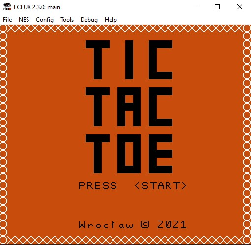
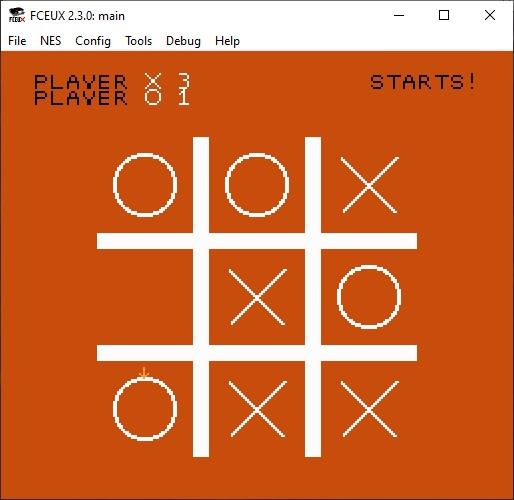

# Tic-Tac-Toe game written in 6502 assembly for the NES.

After over a thousad lines of code in a language I hate, I thnk the project is ready.

## Requirements: 
* [Compiler - cc65](https://cc65.github.io/getting-started.html) (not necessary if you download the package)
* [Emulator - FCEUX](http://fceux.com/web/download.html)

After cloning the repo we type `./make.bat` on Windows or `make` on Linux/macOS. Then, we open **main.nes** file.
If you downloaded the package, there is no need to use make. Just open the file in FCEUX.

## Controls
* Start - begin the game (works only in the title screen)
* Arrows - movement of selection arrow on the board
* A - place X or O

## Screenshots

## Missing features
Win counter only works up to ten wins - after that it breaks. I wanted to fix it at first but implementing sprite update based on decimal value sounds crazy hard and I'm really tired of assembly.

Another thing is that after detecting a winning position, the board is cleared almost immediately. There should be some pause, maybe animation and information about who won. But I belive the counter is enough in this case.

## Sources

Materials I used for learning while making the project:
* [6502 instruction set](http://www.6502.org/tutorials/6502opcodes.html#STA)
* [Nes Dev Wiki](https://wiki.nesdev.com/)
* [Zero Pages video series by Michael Chiaramonte](https://www.youtube.com/watch?v=JgdcGcJga4w&list=PL29OkqO3wUxzOmjc0VKcdiNPqwliHEuEk)
* [FCEUX Debugger documentation](http://fceux.com/web/help/Debugger.html)
* A lot of googling and finding answers on [Nes Dev Forum](https://forums.nesdev.com/)

For anyone interested in editing graphical files, excellent choices are:
* [Nesst - for editing nametables and graphics](https://shiru.untergrund.net/software.shtml)
* [YY-CHR - for editing graphics](https://www.romhacking.net/utilities/119/)

This software is made for Windows, but can be opened on MacOS and Linux using Wine. 

## Contact
If you want to use my code or creeate a similar project - wheter it is for university or for hobby, feel free to contact me. I'm no expert on this, but I know the learning curve of assembly is really steep, so I can definitely help get you started.

*Project made as a part of the "Computer Architecture 2" course organized by Wroclaw University of Science and Technology.*
